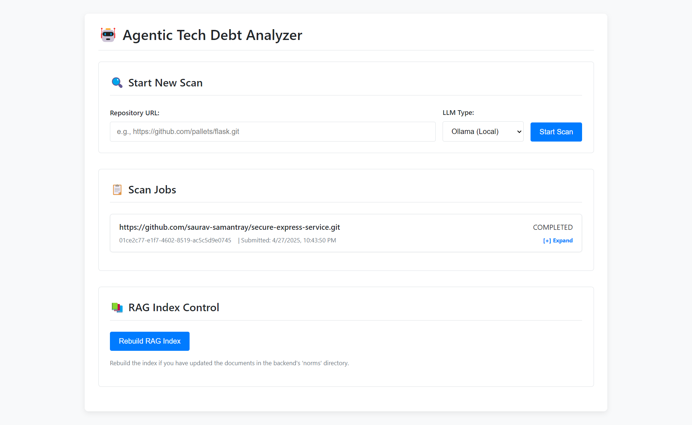
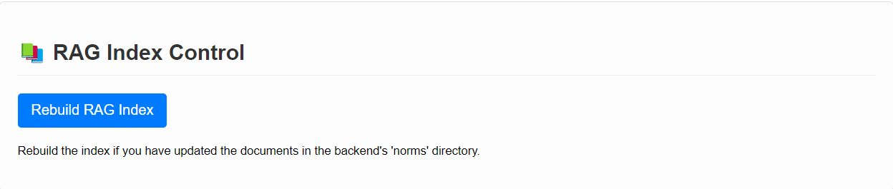
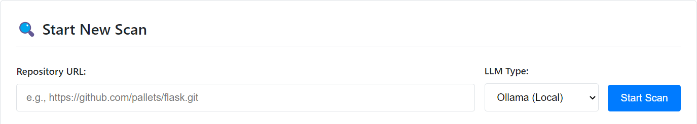
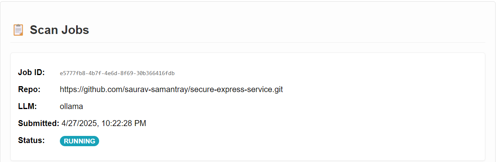
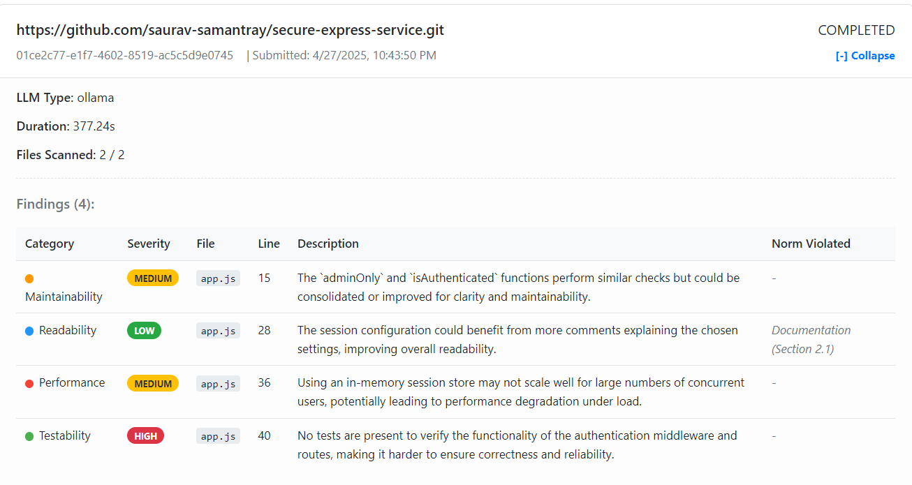

# Agentic AI Tech Debt Analyzer

This project provides a backend Flask API (`tech-debt-service`) and a React frontend (`tech-debt-ui`) for an agentic AI application. It scans code repositories, identifies potential technical debt using LLMs (OpenAI or Ollama), and categorizes it. It features Retrieval-Augmented Generation (RAG) to incorporate organization-specific norms into the analysis.



## Features

*   **Backend Service (`tech-debt-service`):**
    *   Flask API for managing scans and RAG.
    *   Batch code scanning of Git repositories.
    *   LLM integration (OpenAI/Ollama).
    *   RAG using Langchain/FAISS/Sentence Transformers with `.txt`/`.md` norms.
    *   Tech debt categorization based on configurable categories.
    *   Asynchronous scan processing via background threads.
    *   Detailed job status tracking.
    *   CORS enabled for frontend communication.
    *   Configuration via `.env` file.
*   **Frontend UI (`tech-debt-ui`):**
    *   React application to interact with the backend API.
    *   Initiate new code scans.
    *   View list of past and current scan jobs with status polling.
    *   Display detailed findings for completed scans.
    *   Trigger RAG index rebuilds on the backend.

## Technology Stack

*   **Backend (`tech-debt-service`):**
    *   Python, Flask, Flask-CORS
    *   OpenAI Client, Ollama Client
    *   Langchain, FAISS, Sentence Transformers, GitPython
    *   python-dotenv
*   **Frontend (`tech-debt-ui`):**
    *   React, JavaScript
    *   Axios (for API calls)
    *   CSS (for styling)

## Project Structure
```
tech-debt-analyzer-agent/
│
├── tech-debt-service/           # Backend Flask Application
│   ├── app.py                 # Flask application, API endpoints, CORS config
│   ├── agent.py               # Core agent logic (scan orchestration)
│   ├── llm_interface.py       # Abstraction for OpenAI/Ollama interaction, JSON parsing
│   ├── rag_processor.py       # RAG implementation (indexing, retrieval)
│   ├── utils.py               # Helper functions (repo cloning, file handling, job ID)
│   ├── config.py              # Configuration loading from .env
│   ├── requirements.txt       # Python dependencies for backend
│   ├── .env                   # Environment variables (API keys, model names) - **Create here!**
│   │
│   ├── norms/                 # Directory for organizational norm documents
│   │   └── example_norm_1.md  # Example norm file
│   │   └── example_norm_2.txt  # Another example
│   │   └── ... (add your .txt or .md norm files here)
│   │
│   ├── cloned_repos/          # Default directory for temporary repo clones (created automatically)
│   │   └── ... (job-specific subdirectories will appear here during scans)
│   │
│   └── vector_store_faiss/    # Default location for the RAG index (created automatically)
│       └── index.faiss        # Example FAISS index file
│       └── index.pkl          # Example FAISS metadata file
│       └── ... (other index files)
│
├── tech-debt-ui/                # Frontend React Application
│   ├── public/
│   │   ├── index.html
│   │   └── ... (other static assets)
│   │
│   ├── src/
│   │   ├── App.js             # Main React component
│   │   ├── App.css            # Styles for App component
│   │   ├── index.js           # Entry point for React app
│   │   └── ... (other components, services, assets)
│   │
│   ├── package.json           # Node.js dependencies and scripts
│   ├── package-lock.json      # Lockfile for npm dependencies (or yarn.lock)
│   └── ... (other configuration files like .gitignore, etc.)
│
└── README.md                    # This file (Project overview, setup, usage)
```
## Setup and Installation

### Backend (`tech-debt-service`)

1.  **Prerequisites:**
    *   Python 3.8+
    *   Git installed on your system.
    *   (Optional) If using Ollama, ensure the Ollama server is installed and running.

2.  **Navigate to Backend Directory:**
    ```bash
    # From the main project root (e.g., tech-debt-categorization-agent/)
    cd tech-debt-service
    ```

3.  **Install Dependencies:**
    ```bash
    # Ensure you are inside the tech-debt-service directory
    pip install -r requirements.txt
    # You might need extra dependencies for specific document loaders (e.g., Markdown)
    # pip install "unstructured[md]"
    ```

4.  **Configure Environment:**
    *   Create a `.env` file **inside the `tech-debt-service` directory**.
    *   Use the example below as a template, filling in your specific values.

    **Example `tech-debt-service/.env` file:**
    ```dotenv
    # --- General ---
    FLASK_SECRET_KEY='a_very_secret_key_change_me'
    REPO_CLONE_DIR='./cloned_repos' # Relative to tech-debt-service
    NORMS_DIR='./norms'             # Relative to tech-debt-service
    ALLOWED_EXTENSIONS='.py,.js,.java,.ts,.cs,.go,.rb,.php,.md'

    # --- RAG ---
    EMBEDDING_MODEL_NAME='all-MiniLM-L6-v2'
    VECTOR_STORE_PATH='./vector_store_faiss' # Relative to tech-debt-service
    CHUNK_SIZE=1000
    CHUNK_OVERLAP=100
    RAG_TOP_K=3

    # --- LLM ---
    OPENAI_API_KEY='your_openai_api_key_here'
    OPENAI_MODEL_NAME='gpt-4o-mini'
    OLLAMA_BASE_URL='http://localhost:11434'
    OLLAMA_MODEL_NAME='llama3' # Ensure pulled: ollama pull llama3

    # --- Agent ---
    TECH_DEBT_CATEGORIES='Maintainability,Readability,Performance,Security,Testability,Documentation,Duplication,Architectural Violation,Deprecated Usage'
    ```

5.  **Ollama Setup (If using Ollama):**
    *   Ensure the Ollama server is running (`ollama serve`).
    *   Pull the required model: `ollama pull <model_name_from_env>`.

6.  **Add Organizational Norms:**
    *   Place your `.txt` or `.md` norm files inside the `tech-debt-service/norms/` directory.

### Frontend (`tech-debt-ui`)

1.  **Prerequisites:**
    *   Node.js and npm (or yarn).

2.  **Navigate to Frontend Directory:**
    ```bash
    # From the main project root (e.g., tech-debt-categorization-agent/)
    cd tech-debt-ui
    ```

3.  **Install Dependencies:**
    ```bash
    # Ensure you are inside the tech-debt-ui directory
    npm install
    # or: yarn install
    ```

4.  **Configuration (API URL):**
    *   The frontend (`src/App.js`) assumes the backend API is running at `http://localhost:5001`. If your backend runs elsewhere, update the `API_BASE_URL` constant in `src/App.js`.

## Running the Application

1.  **Start the Backend:**
    *   Navigate to the backend directory:
        ```bash
        # From the main project root
        cd tech-debt-service
        ```
    *   Run the Flask app:
        ```bash
        python app.py
        ```
    *   The backend API will start, typically on `http://0.0.0.0:5001`.

2.  **Start the Frontend:**
    *   Open a **new terminal window/tab**.
    *   Navigate to the frontend directory:
        ```bash
        # From the main project root
        cd tech-debt-ui
        ```
    *   Run the React development server:
        ```bash
        npm start
        # or: yarn start
        ```
    *   The frontend application will open in your browser, usually at `http://localhost:3000`.

*Ensure the backend is running before starting the frontend, as the frontend needs to make API calls to the backend.*

## API Endpoints (Backend - `tech-debt-service`)

*(These endpoints are accessed by the frontend UI)*

### 1. Start Scan

*   **Method:** `POST`
*   **Path:** `/scan`
*   **Description:** Initiates a new asynchronous scan.
*   **Request Body:** `{ "repo_url": "...", "llm_type": "openai|ollama" }`
*   **Response (202):** Initial job details including `job_id`.

### 2. Check Scan Status

*   **Method:** `GET`
*   **Path:** `/status/<job_id>`
*   **Description:** Retrieves the current status and results of a scan.
*   **Response (200):** Detailed job object including `status`, `findings` (if completed), `error` (if failed), timestamps, etc.

### 3. Rebuild RAG Index

*   **Method:** `POST`
*   **Path:** `/rag/rebuild`
*   **Description:** Reloads norms and rebuilds the RAG vector index.
*   **Response (200):** Success message.


### 4. Index / Health Check

*   **Method:** `GET`
*   **Path:** `/`
*   **Description:** Confirms the API is running.
*   **Response (200):** API status message and endpoint list.

## Configuration Details (`tech-debt-service/.env`)

*(Refer to the example `.env` file content in the Setup section above for details on each variable)*

## How it Works (Agent Workflow)

*(The core workflow remains the same as described previously, executed within the `tech-debt-service` backend)*

1.  Frontend sends request to `/scan`.
    
2.  Backend (`app.py`) creates job, starts background thread (`agent.py`).
    
3.  Background thread clones repo, initializes RAG, finds files (`utils.py`, `rag_processor.py`).
4.  For each file, RAG retrieves norms, LLM analyzes code+norms, response is parsed (`agent.py`, `llm_interface.py`).
5.  Job status updated (`COMPLETED`/`FAILED`), results stored in memory.
6.  Repo cleaned up (`utils.py`).
7.  Frontend polls `/status/<job_id>` to display progress and results.
    

## Limitations and Considerations

*   **Persistence:** Backend job store is in-memory. Backend restarts lose job history. Use Redis/DB + Celery/RQ for production.
*   **Large Files/Context Windows:** Code chunking for large files is not implemented.
*   **Scalability:** Basic threading used. Task queues recommended for higher loads.
*   **LLM Accuracy/Cost/Performance:** Results vary; review is needed. Monitor OpenAI costs. Ollama speed depends on hardware.
*   **Security:** Sandbox execution if cloning untrusted code. Protect API keys. Consider backend API authentication.
*   **Synchronous RAG Rebuild:** `/rag/rebuild` blocks briefly. Consider async for large norm sets.

## Contributing

Contributions are welcome! Please open issues or submit pull requests to the appropriate service (`tech-debt-service` or `tech-debt-ui`).

## License

MIT License

Copyright (c) 2025 Saurav Samantray

Permission is hereby granted, free of charge, to any person obtaining a copy
of this software and associated documentation files (the "Software"), to deal
in the Software without restriction, including without limitation the rights
to use, copy, modify, merge, publish, distribute, sublicense, and/or sell
copies of the Software, and to permit persons to whom the Software is
furnished to do so, subject to the following conditions:

The above copyright notice and this permission notice shall be included in all
copies or substantial portions of the Software.

THE SOFTWARE IS PROVIDED "AS IS", WITHOUT WARRANTY OF ANY KIND, EXPRESS OR
IMPLIED, INCLUDING BUT NOT LIMITED TO THE WARRANTIES OF MERCHANTABILITY,
FITNESS FOR A PARTICULAR PURPOSE AND NONINFRINGEMENT. IN NO EVENT SHALL THE
AUTHORS OR COPYRIGHT HOLDERS BE LIABLE FOR ANY CLAIM, DAMAGES OR OTHER
LIABILITY, WHETHER IN AN ACTION OF CONTRACT, TORT OR OTHERWISE, ARISING FROM,
OUT OF OR IN CONNECTION WITH THE SOFTWARE OR THE USE OR OTHER DEALINGS IN THE
SOFTWARE.


